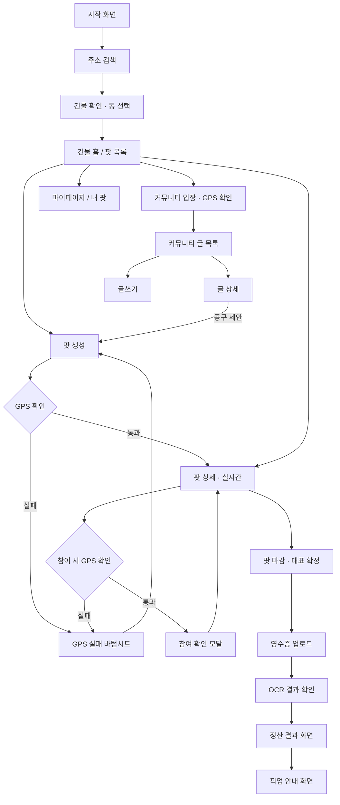

# 디자인 핸드오프 — 화면별 상세 (홍수진 담당)

> ⚠️ **기획 개편(2026-10-03)**: QR 스캔(S1~S3)이 주소검색+GPS로, 최저가 조회(S13)가 삭제되고 커뮤니티(S16~S18)가 추가됐습니다. 변경분만 이 머리말 아래 반영돼 있고, 구체적인 화면별 지시는 [design-changes.md](./design-changes.md)에 더 자세히 있습니다.

이 문서는 사업계획서 내용을 화면 단위로 쪼갠 것입니다. Figma 작업 시 이 순서/구성대로 만들면 되고, 각 화면에 왜 이런 요소가 필요한지 근거(설문 데이터 등)도 같이 적어뒀으니 디자인 톤 잡을 때 참고해주세요.

## 톤앤매너 힌트

- 타겟은 **인하대 근처(인천 미추홀구 용현동·학익동) 주민** — 자취생은 그중 한 집단. 초기 검증은 자체 설문(자취생 43명, 대용량 사면 저렴한 거 알지만 혼자 다 못 먹고 버리는 경험 88%, 79%가 최근 1개월 내 폐기 경험)으로 했고, 대상을 넓히면서 비자취생 주민 대상 추가 검증이 필요.
- 품목은 **생필품+가공식품만** (신선식품 제외). 화장지·키친타월·물티슈·세탁세제 같은 생필품, 생수·라면·즉석밥 같은 가공식품 중심으로 예시/이미지를 잡아주세요.
- 가장 큰 심리적 장벽은 **낯선 이웃과의 접촉 부담(설문 1위, 56%)**. 그래서 전체 톤은 "이웃과 친해지자"가 아니라 **"얼굴 안 봐도 되고, 돈 아낀다"**에 가까워야 함 — 비대면 수령, 실시간 절약액 숫자를 강조.
- 경쟁 대비 차별점은 "번거로움 없음"과 "손해 안 봄"이니, 로딩/에러 상태에서도 불안하지 않게 안내 문구를 명확히.

## 전체 플로우



## 화면 목록

| ID | 화면명 | 우선순위 | 관련 기능 |
| --- | --- | --- | --- |
| S0 | 시작 화면 | 필수 | - |
| S1 | 주소 검색 | 필수 | ① 온보딩 |
| S1-2 | 건물 확인 · 동 선택 | 필수 | ① 온보딩 |
| S2 | GPS 확인 중 (인라인, 전체화면 아님) | 필수 | ① 온보딩 |
| S3-a/b/c | GPS 실패 바텀시트 3종 | 필수 | ① 온보딩 |
| S4 | 건물 홈 / 팟 목록 | 필수 | ② 팟 |
| S5 | 팟 생성 | 필수 | ② 팟 |
| S6 | 팟 상세 (실시간) | 필수 (핵심) | ② 팟 |
| S7 | 참여 확인 모달 | 필수 | ② 팟 |
| S8 | 팟 마감 · 대표 확정 | 필수 | ② 팟 |
| S9 | 영수증 업로드 | 필수 | ③ 정산 |
| S10 | OCR 인식 결과 확인 | 필수 | ③ 정산 |
| S11 | 정산 결과 | 필수 (핵심) | ③ 정산 |
| S12 | 픽업 안내 | 필수 | ③ 정산 |
| S14 | 마이페이지 / 내 팟 | 필수 | 공통 |
| S15 | 하단 네비게이션 (공통 컴포넌트) | 필수 | 공통 |
| S16 | 커뮤니티 글 목록 | 필수 | ⑤ 커뮤니티 |
| S17 | 커뮤니티 글 상세 | 필수 | ⑤ 커뮤니티 |
| S18 | 커뮤니티 글쓰기 | 필수 | ⑤ 커뮤니티 |

~~S13 최저가 조회~~ — 기획 개편으로 삭제됨.

---

## S0. 시작 화면

- **목적**: 앱 첫 진입, 아직 건물 인증 전 상태.
- **구성 요소**: 로고/서비스명, 한 줄 소개("같은 건물 이웃과 대용량을 나눠요"), "우리 건물 인증하기" CTA 버튼.
- **상태**: 최초 진입만 존재 (로그인 개념 없음, 건물 인증이 곧 진입 절차).
- **디자인 참고**: 접촉 부담이 큰 타겟이니 "이웃과 친해지는 서비스"보다 "돈 아끼는 서비스"로 먼저 각인되게 카피/비주얼 잡기.

## S1. 주소 검색

- **목적**: 가입 시 1회, 도로명주소를 검색해 건물을 찾는다.
- **구성 요소**: 검색창(도로명주소 입력), 검색 결과 리스트(건물명 + 주소), 빈 상태("검색 결과가 없어요, 도로명을 다시 확인해주세요").
- **상태**: 입력 전 / 검색 중 / 결과 있음 / 결과 없음.
- **관련 기능**: ① — `GET /auth/addresses/search?keyword=`.

## S1-2. 건물 확인 · 동 선택

- **목적**: 검색 결과에서 하나를 골라 "이 건물이 맞는지" 확인하고, 아파트면 동까지 선택.
- **구성 요소**: 선택한 건물명·주소 카드("제니스빌 이웃으로 등록돼요"), 아파트인 경우 동 선택 리스트(검색 API가 동 목록을 안 주면 직접입력 폼으로 폴백), "등록하기" 버튼.
- **상태**: 빌라/원룸(동 선택 없음) / 아파트(동 리스트) / 아파트(동 직접입력 폴백).
- **관련 기능**: ① — `POST /auth/buildings/register`.

## S2. GPS 확인 중 (인라인)

- **목적**: 팟 개설·참여·커뮤니티 입장 "버튼을 누른 그 자리"에서 짧게 뜨는 위치 확인 표시. 전체 화면 전환이 아니다.
- **구성 요소**: 버튼 안 또는 바로 아래에 작은 로딩 인디케이터 + "위치를 확인하고 있어요" 문구.
- **상태**: 확인 중 / 통과(그대로 다음 동작 진행) / 실패(S3 바텀시트로 전환).
- **디자인 참고**: "건물 안에 있는 이웃인지 확인하는 용도"라고 짧게 신뢰 문구 추가 권장. 매 행동마다 뜨므로 너무 느리거나 거슬리지 않게(1초 내외 체감) 디자인.

## S3. GPS 실패 바텀시트 (3종)

- **목적**: 반경 밖 / 위치 권한 거부 / 위치 못 받음(타임아웃) — 세 경우를 각각 다른 문구로 안내.
- **구성 요소**: 실패 사유 아이콘, 문구(아래 표), [다시 확인] 버튼. 반경 밖인 경우만 "빠른 위치 인식 해결 방법"(와이파이 켜기, 로비로 이동) 팁 섹션 추가.

| 상황 | 문구 |
| --- | --- |
| 반경 밖 | 지금 위치가 등록한 건물({건물명})과 달라요. 집에 돌아가서 다시 시도해 주세요. |
| 권한 거부 | 이웃 확인을 위해 위치 권한이 필요해요. (+ 권한 설정 방법 안내) |
| 위치 못 받음 | 위치를 확인하지 못했어요. 창가나 건물 입구 근처에서 다시 시도해 주세요. |

- **디자인 참고**: 전체 화면이 아니라 바텀시트로 띄워서, 닫으면 원래 하려던 동작(팟 개설 폼 등)으로 바로 돌아가게. 에러 화면에서도 "번거롭다"는 인상을 주지 않도록 톤을 가볍게.

## S4. 건물 홈 / 팟 목록

- **목적**: 인증된 건물 안에서 진행 중인 팟을 확인하는 메인 화면.
- **구성 요소**: 건물명(+동) 표시(하드코딩 아니라 등록된 값), 진행중 팟 카드 리스트(상품명, 현재 인원/목표 인원, 1인당 예상 금액, 마감까지 남은 시간), "+ 팟 만들기" FAB 버튼.
- **상태**: 팟 있음(리스트) / 팟 없음(빈 상태 — "아직 열린 팟이 없어요, 첫 팟을 만들어보세요" + CTA) / 로딩.
- **품목 예시**: 생필품(화장지 30롤 등)·가공식품(생수 2L×24병 등)으로 — 계란/식재료 이미지 사용하지 않기.
- **관련 기능**: ② — `GET /pods?buildingId=&userId=`

## S5. 팟 생성

- **목적**: 대표(개설자)가 새 팟을 만드는 폼.
- **구성 요소**: 상품명 입력, 목표 총액 또는 목표 인원(둘 중 하나 기준 선택), 대표 수고비율 설정(기본 5%, 슬라이더 또는 입력), 마감 기한 설정.
- **상태**: 입력 중 / 유효성 에러(금액 0원 이하 등) / GPS 확인 중(S2 인라인) / GPS 실패(S3) / 생성 완료(S6로 이동).
- **커뮤니티 연동**: 커뮤니티의 "공구 제안" 글에서 넘어온 경우, 상품명이 미리 채워진 채 "커뮤니티 제안에서 가져왔어요" 안내 문구 표시.
- **디자인 참고**: 수고비율을 처음 만드는 사람도 이해하게 "수고비 5% → 총액 5만원이면 대표가 2,500원 더 받아요" 같은 실시간 예시 문구 필요.

## S6. 팟 상세 (실시간) — 핵심 화면

- **목적**: 팟의 실시간 참여 현황과 1인당 금액을 보여주고 참여를 유도.
- **구성 요소**:
  - 상단: 상품명, 대표 닉네임, 마감까지 남은 시간
  - 중앙: **1인당 금액이 참여자가 늘 때마다 실시간으로 줄어드는 애니메이션 숫자** (설문 근거: 대용량-소포장 단가 격차 30~53%가 핵심 셀링포인트이므로, 숫자가 줄어드는 걸 시각적으로 강조)
  - 절약 비교: "혼자 소포장으로 사면 OOO원 → 지금 참여하면 OOO원 (▼ 35% 절약)"
  - 참여자 아바타/닉네임 리스트 (실명 대신 익명 아바타 — 접촉 부담 낮추는 설계)
  - 참여 버튼 (하단 고정)
- **상태**: 참여 전 / GPS 확인 중(S2 인라인, 참여 버튼 누른 직후) / GPS 실패(S3) / 참여 완료(버튼이 "참여중" 뱃지로 변경) / 마감됨(참여 버튼 비활성) / 실시간 갱신 중(숫자 변경 시 짧은 하이라이트 애니메이션).
- **관련 기능**: ② — WebSocket `/topic/pods/{id}` 구독, `PodAmountUpdateEvent` 수신.
- **디자인 참고**: 이 화면이 서비스의 핵심 "훅"입니다. 실시간으로 숫자가 내려가는 걸 가장 눈에 띄게 디자인해주세요.

## S7. 참여 확인 모달

- **목적**: 참여 확정 전 최종 금액을 확인시키는 단계.
- **구성 요소**: 확정 1인당 금액(참여 시점 기준), 대표 수고비 포함 안내, "참여 확정" / "취소" 버튼, 결제는 팟 마감 후 진행됨을 명시.
- **상태**: 기본 / 참여 처리 중(로딩) / 실패(네트워크 등).

## S8. 팟 마감 · 대표 확정 화면

- **목적**: 대표가 목표 달성 후 팟을 마감하고 실제 구매를 진행하는 단계임을 표시.
- **구성 요소**: 최종 참여자 수, 확정된 1인당 예상 금액, "구매하러 가기" 안내(대표가 실제로 마트/온라인몰에서 구매), "영수증 업로드하기" 버튼(대표에게만 노출).
- **상태**: 대표 시점(영수증 업로드 CTA 노출) / 참여자 시점(대기 안내 "대표가 구매 중이에요").

## S9. 영수증 업로드

- **목적**: 대표가 실제 구매 영수증 사진을 업로드.
- **구성 요소**: 카메라/갤러리 선택 버튼, 업로드된 이미지 미리보기, 업로드 버튼.
- **상태**: 업로드 전 / 업로드·OCR 처리 중(로딩) / OCR 실패(→ 수동 입력 폼으로 자동 전환, fallback).

## S10. OCR 인식 결과 확인

- **목적**: OCR로 인식된 금액을 대표가 확인/수정.
- **구성 요소**: 인식된 총 금액(수정 가능한 입력 필드로), 원본 영수증 이미지 썸네일, "확정" 버튼.
- **상태**: 인식 성공(값이 채워진 채 확인만) / 인식 실패(빈 입력창 + "직접 입력해주세요").

## S11. 정산 결과 화면 — 핵심 화면

- **목적**: 참여자별 최종 정산 금액과 절약 효과를 보여주는, 서비스 가치를 체감시키는 화면.
- **구성 요소**:
  - 내가 낼 최종 금액 (원가 + 대표 수고비 정률 반영)
  - **혼자 샀을 때 대비 절약액/절약률** (팟 참여 전 S6에서 보여준 예상치와 실제값 비교)
  - 대표가 입력한 `hostPaymentLink`(토스/카카오페이 "송금 요청" 링크나 계좌) 표시 카드 + "보냈어요" 버튼 (현재 백엔드엔 있지만 화면이 없던 부분 — 이번에 추가)
  - 결제 완료 체크 상태 (참여자가 "보냈어요" 표시하면 대표 화면에 반영)
- **상태**: 결제 전 / 결제 완료 표시 / 전원 결제 완료(팟 종료).
- **디자인 참고**: 절약액 누적 표시는 설문에서 확인된 핵심 동기(단가 격차 30~53%)를 다시 한번 체감시키는 장치이므로, 숫자를 크고 명확하게.

## S12. 픽업 안내 화면

- **목적**: 완전 비대면 수령을 위한 안내 (접촉 부담 1위 문제에 대한 직접적인 해결책).
- **구성 요소**: 수령 장소(택배함 몇 호 / 문고리 등 대표가 지정), 원 포장을 나눈 라벨 사진(대표가 공유), "수령 완료" 체크 버튼.
- **상태**: 픽업 대기 / 픽업 완료.
- **디자인 참고**: 설문상 접촉 부담이 망설임 이유 1위(56%)였으므로, 이 화면은 "얼굴 안 마주쳐도 된다"는 안심감을 시각적으로 강조 (예: 사람 아이콘 대신 택배함/문 아이콘 중심 구성).

## ~~S13. 최저가 조회~~ — 삭제됨

기획 개편으로 완전히 삭제됐습니다. 검색창·최저가 리스트 화면은 더 만들지 않습니다.

## S14. 마이페이지 / 내 팟

- **목적**: 내가 참여/개설한 팟 히스토리와 누적 절약액 확인. "내 팟"이 하단 탭으로 승격되면서 마이페이지에서 분리될 수 있음(프론트 구현 편의에 따라 한 화면 안에서 탭으로 나눠도 됨).
- **구성 요소**: 참여 팟 리스트(상태별: 진행중/정산중/완료), 누적 절약액 총합.

## S15. 하단 네비게이션 (공통 컴포넌트)

- **탭 구성**: **팟 · 커뮤니티 · 내 팟 · 마이** (4탭). 기존 "최저가" 탭은 삭제.
- 온보딩(S0~S1-2) 플로우에서는 네비게이션 노출 안 함.

## S16. 커뮤니티 글 목록

- **목적**: 건물 안 익명 커뮤니티 — 입장 시 GPS 확인(S2) 먼저 거침.
- **구성 요소**: 카테고리 탭(자유/질문/나눔/공구 제안), 글 카드(익명 닉네임 "이웃 N", 미리보기 텍스트, 댓글 수, 작성 시각), 글쓰기 FAB 버튼.
- **상태**: 글 있음 / 빈 상태("아직 글이 없어요") / GPS 확인 중·실패(S2/S3).

## S17. 커뮤니티 글 상세

- **목적**: 글 본문과 댓글을 보고, 댓글을 달거나 신고.
- **구성 요소**: 본문(작성자는 "글쓴이" 뱃지), 댓글 리스트(각 댓글에 "이웃 N" 또는 "글쓴이" 뱃지), 댓글 입력창, 신고 버튼(⋯ 메뉴, 신고 누르면 "신고했어요" 토스트). 카테고리가 "공구 제안"이면 본문 하단에 **[이 품목으로 팟 열기]** 버튼.
- **상태**: 기본 / 본인 글(삭제 버튼 노출) / 공구 제안(팟 열기 버튼 노출).

## S18. 커뮤니티 글쓰기

- **목적**: 새 글 작성.
- **구성 요소**: 카테고리 선택(세그먼트 컨트롤), 본문 입력창, 등록 버튼.
- **상태**: 입력 중 / 유효성 에러(본문 비어있음) / 등록 완료(S16으로 이동).

---

## 디자인 시스템 관련 메모

- 색상/타이포 등 디자인 토큰은 홍수진이 Figma에서 먼저 잡고, 팀에 공유해주시면 프론트에서 그대로 반영할게요 (별도 문서 없이 Figma 링크 공유로 충분).
- 컴포넌트 단위로 먼저 만들면 좋은 것: 팟 카드, 실시간 금액 숫자(애니메이션 포함), 절약액 배지, 하단 고정 버튼, 빈 상태(empty state) 일러스트.

---

## 스티치(Google Stitch) 등 AI 디자인 툴로 작업할 경우

홍수진이 Figma를 처음부터 그리기보다 스티치 같은 AI 툴로 초안을 뽑고 다듬는 방식이라면, 위 화면별 설명을 그대로 넣기보다 **자연어 프롬프트로 재구성**해서 넣는 게 훨씬 잘 나옵니다. 스티치는 색감/톤 같은 스타일을 지정하면 한 프로젝트 안에서 여러 화면에 일관되게 적용해주는 "테마" 개념이 있어서, 화면을 하나씩 따로 넣기보다 **아래처럼 한 번에 통째로** 넣는 걸 추천합니다.

### 마스터 프롬프트 (복사해서 사용)

```
인하대 근처 동네 이웃끼리 생필품·가공식품을 나눠 사는 하이퍼로컬 공동구매 앱
"소분소분"의 UI를 디자인해줘. 타겟은 인천 미추홀구 용현동·학익동 일대 빌라·
원룸·아파트 주민(자취생도 그중 일부)이고, 낯선 이웃과 마주치는 걸 부담스러워
해서(설문 조사 결과 1위 이유) 전체 흐름이 완전 비대면으로 진행되는 게 중요해.
톤은 친근하고 안심되는 느낌, 따뜻한 파스텔 색감에 포인트 컬러 하나, 둥근 모서리
카드 UI를 사용해줘. 아래 화면들을 하나의 프로젝트로, 색상·폰트·컴포넌트 스타일이
전부 일관되게 만들어줘.

1. 시작 화면 — 로고, 한 줄 소개, "우리 건물 등록하기" 버튼
2. 주소 검색 화면 — 검색창, 도로명주소 검색 결과 리스트
3. 건물 확인 화면 — "제니스빌 이웃으로 등록돼요" 확인 카드, 아파트면 동 선택 리스트
4. 건물 홈(팟 목록) — 진행 중인 공동구매(팟) 카드 리스트. 각 카드에 상품명
   (화장지·생수 같은 생필품/가공식품 예시), 현재 참여인원/목표인원, 1인당 예상
   금액, 마감까지 남은 시간. 오른쪽 하단에 + 버튼으로 팟 만들기
5. 팟 생성 화면 — 상품명, 목표 금액, 대표 수고비율, 마감 기한을 입력하는 폼
6. 팟 상세 화면(가장 중요한 화면) — 화면 중앙에 1인당 금액을 크게 강조,
   참여자가 늘수록 숫자가 줄어드는 느낌의 실시간 카운터, "혼자 사면 OOO원 →
   지금 참여하면 OOO원, OO% 절약" 비교 배지, 참여자 익명 아바타 리스트,
   하단 고정 참여 버튼
7. 정산 결과 화면(중요) — 내가 낼 최종 금액과 절약액/절약률을 크고 눈에 띄게,
   송금 링크 표시 + "보냈어요" 버튼
8. 픽업 안내 화면 — 택배함이나 문고리 같은 비대면 수령 방법을 아이콘 중심으로
9. 커뮤니티 글 목록 화면 — 카테고리 탭(자유/질문/나눔/공구 제안), 익명 닉네임
   ("이웃 1" 식)이 달린 글 카드 리스트, 글쓰기 버튼
10. 커뮤니티 글 상세 화면 — 본문, 익명 댓글 리스트, "공구 제안" 글이면
    "이 품목으로 팟 열기" 버튼
```

### 추가로 따로 요청하면 좋은 프롬프트 (스티치가 기본으로 안 만들어주는 것들)

```
건물 홈 화면에서 아직 열린 팟이 하나도 없는 빈 상태 화면을 같은 스타일로 만들어줘.
팟 상세 화면에서 마감되어 참여 버튼이 비활성화된 상태도 같은 스타일로 만들어줘.
위치 확인에 실패했을 때(반경 이탈 / 권한 거부 / 위치 못 받음, 3종) 보여줄
바텀시트 3개를 같은 스타일로 만들어줘.
```

### 참고

- 생성된 결과는 Figma로 붙여넣기가 되니, 세부 정렬이나 컴포넌트화는 거기서 다듬으면 됩니다.
- 스티치는 정적 디자인만 만들어주고 화면 간 클릭 흐름(인터랙션)은 안 만들어주니, 실제 전환 로직은 프론트 개발자가 위 [전체 플로우](#전체-플로우)대로 구현하면 됩니다.
- 위 화면별 상세 설명(S0~S15)은 프롬프트에 다 담기엔 길어서 요약했어요 — 특정 화면을 더 다듬고 싶을 때 원본 설명을 참고해주세요.
