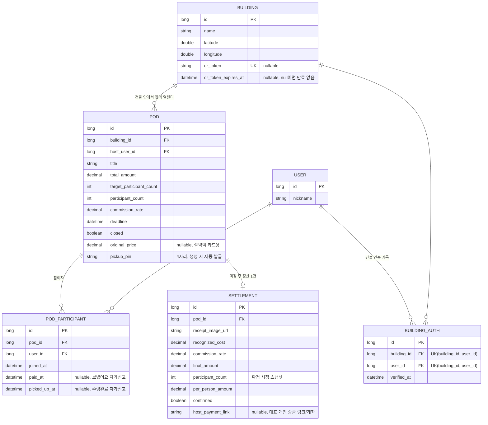

# ERD 초안

실제 컬럼은 개발하면서 조정하되, 4개 도메인의 관계는 아래 구조를 기준으로 시작합니다.

## 메모

- `BUILDING_AUTH`는 `auth/domain/BuildingAuth` 엔티티로 추가됐습니다. `(building_id, user_id)` 유니크라서 같은 사용자가 같은 건물에 다시 인증하면 새 행 없이 `verified_at`만 갱신됩니다. `USER` 엔티티가 아직 없어서 `building_id`/`user_id`는 DB FK 없이 id 값만 저장합니다 (`POD.building_id`와 같은 방식).
- `BUILDING.qr_token`/`qr_token_expires_at`은 QR 인증용 컬럼입니다. 토큰이 없는 기존 건물 행을 위해 nullable이며, 만료 시각이 null이면 만료 없음(데모용 고정 QR)으로 취급합니다.
- `POD.target_participant_count` 도달 시에만 마감합니다 (목표 금액 방식은 MVP에서 지원 안 함). `deadline`은 화면 표시/참고용이며, 기한이 지나도 자동으로 마감·취소되지 않습니다 — 마감은 대표의 수동 조작(`closed=true`)으로만 이뤄집니다.
- `POD.pickup_pin`은 `POD` 응답엔 노출하지 않습니다 (비참여자에게 보이면 락커 보안 의미가 없어짐) — 참여자 본인 조회(`GET /pods/{id}/me`)에만 포함됩니다.
- `POD_PARTICIPANT.paid_at`/`picked_up_at`, `SETTLEMENT.host_payment_link`는 실제 결제/알림 연동이 아니라 자가 신고·수동 링크 입력입니다 (카카오 알림톡·토스페이먼츠 API 연동은 하켓톤 범위에서 불가능 — [handoff/settlement-screens.md](./handoff/settlement-screens.md) 참고).
- 최저가 조회(`PRODUCT`)는 다른 도메인과 직접적인 FK 관계가 없는 독립 캐시 테이블로 둡니다.
