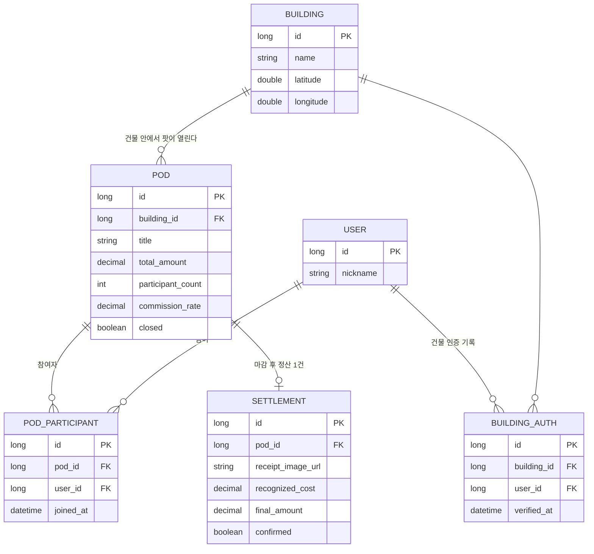

# ERD 초안

실제 컬럼은 개발하면서 조정하되, 4개 도메인의 관계는 아래 구조를 기준으로 시작합니다.

## 메모

- `POD_PARTICIPANT`, `BUILDING_AUTH`는 아직 엔티티로 만들지 않았습니다 (담당자가 작업하며 추가).
- 최저가 조회(`PRODUCT`)는 다른 도메인과 직접적인 FK 관계가 없는 독립 캐시 테이블로 둡니다.
