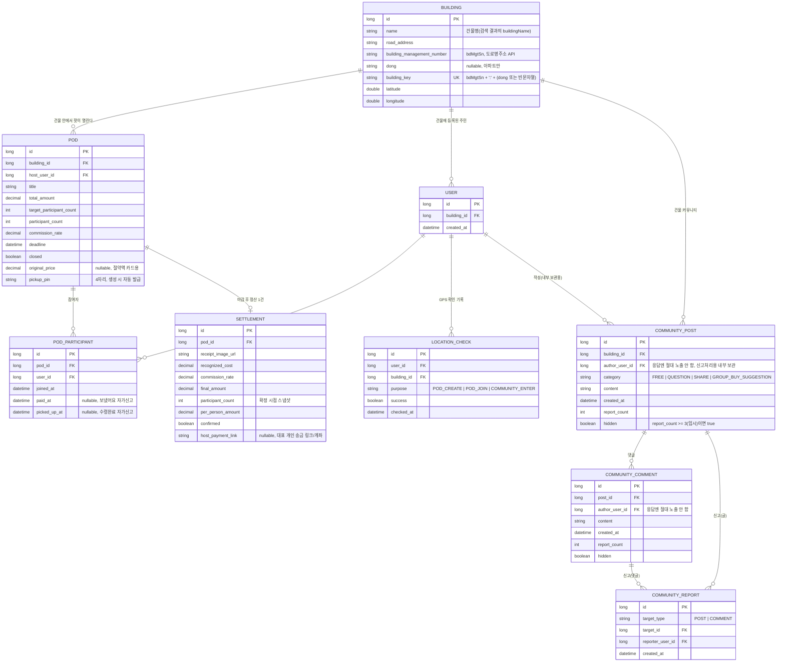

# ERD 초안

> ⚠️ **기획 개편(2026-10-03)**: QR 관련 컬럼·`PRODUCT` 테이블을 제거하고, 주소/GPS 기반 인증과 커뮤니티 테이블을 추가했습니다. 실제 반영은 [REPLAN_WORK_ASSIGNMENT.md](./REPLAN_WORK_ASSIGNMENT.md) 순서대로 진행됩니다.

실제 컬럼은 개발하면서 조정하되, 아래 구조를 기준으로 시작합니다.

## 메모

- `USER`가 처음으로 생기는 엔티티입니다. 로그인이 없어 지금처럼 임의의 숫자 `userId`를 쓰지만, 이 테이블이 "이 userId가 어느 건물 소속인지"의 근거가 되어 건물 소속 검증(`BuildingAccessService`)에 쓰입니다.
- `BUILDING.building_key`는 서버가 계산해서 저장하는 유니크 키입니다. 빌라/원룸은 `bdMgtSn`만, 아파트는 `bdMgtSn + 동`까지 같아야 같은 건물로 취급합니다.
- `LOCATION_CHECK`는 원본 좌표를 저장하지 않고 판정 결과·시각·목적만 남깁니다(개인정보 보호 — [기획수정_프롬포트.md](../기획수정_프롬포트.md) 1-3절).
- `COMMUNITY_POST`/`COMMUNITY_COMMENT`의 `author_user_id`는 DB에는 있지만 **API 응답에는 절대 포함하지 않습니다** — 익명 닉네임("이웃 N"/"글쓴이")은 응답 조립 시점에 매번 계산하고 저장하지 않습니다.
- `POD.target_participant_count` 도달 시에만 마감(기존과 동일, 변경 없음).
- `BUILDING_AUTH`(과거 QR 인증 기록 테이블)와 `PRODUCT`(최저가 캐시 테이블)는 **삭제됩니다.**
